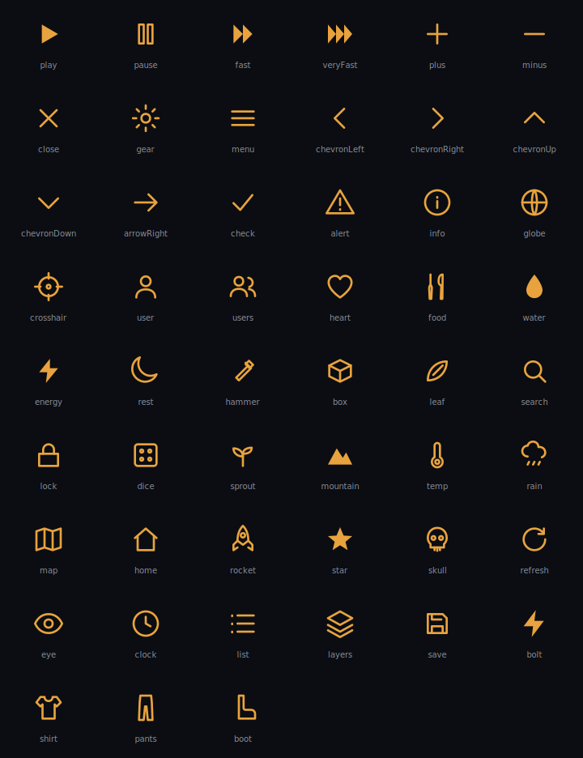

# Icons

The Salvage line-icon set, 51 glyphs. The path data is canonical in [icons.json](./icons.json) (generated from the prototype's `Icon.tsx` by `scripts/extract-icons.mjs`); this doc previews them. These glyphs only ever existed as inline JSX, so icons.json is where they live now.

## Format

- 24x24 viewBox, drawn at any pixel size.
- Stroked with `currentColor` (round caps and joins, stroke-width 1.6) so an icon inherits its parent's text color and any glow on it.
- 8 glyphs read better filled and default to `fill: currentColor` instead: `play`, `fast`, `veryFast`, `energy`, `bolt`, `star`, `mountain`, `water`. The `filled` flag in icons.json marks them; a caller can override per-instance.
- No fallback for an unknown name; callers pass a known glyph.

## The set

Grouped by use. Names are the keys in icons.json.

- Playback / speed: `play`, `pause`, `fast`, `veryFast`
- Controls: `plus`, `minus`, `close`, `gear`, `menu`, `refresh`, `search`, `save`, `list`, `layers`, `eye`, `lock`, `dice`
- Arrows: `chevronLeft`, `chevronRight`, `chevronUp`, `chevronDown`, `arrowRight`
- Status: `check`, `alert`, `info`, `star`, `skull`, `clock`
- World / map: `globe`, `crosshair`, `map`, `home`, `mountain`, `leaf`, `sprout`, `temp`, `rain`
- People: `user`, `users`
- Needs: `heart`, `food`, `water`, `energy`, `rest`
- Work / items: `hammer`, `box`, `rocket`, `bolt`
- Apparel: `shirt`, `pants`, `boot`

## Related

- [icons.json](./icons.json) — canonical names, filled flags, and SVG path data
- [components.md](./components.md#icon) — the Icon primitive
- [design-language.md](../design-language.md) — how icons sit in the system
