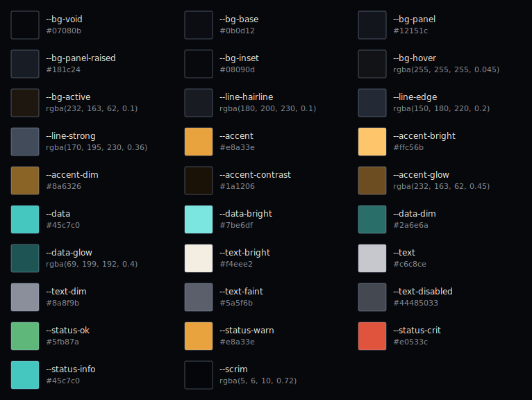

# Design tokens

Every design value in the Salvage system, the readable companion to [tokens.json](./tokens.json). The JSON is canonical and machine-readable (colors carry normalized rgba floats for the C++ `Foundation::Color` seed); this doc is for reading. Both are generated from `docs/ui-prototype/src/design-system/tokens.css` by `scripts/extract-tokens.mjs`, so they can't drift.

Tokens marked **css-only** are CSS effects with no static value (gradients, eases, multi-layer shadows, font stacks). They don't carry a number; the C++ port handles each deliberately (see [design-language.md → what won't port literally](../design-language.md#what-wont-port-literally)).

## Palette

### Surfaces

| Token | Value | Use |
|-------|-------|-----|
| `--bg-void` | `#07080b` | app background, deepest |
| `--bg-base` | `#0b0d12` | base layer |
| `--bg-panel` | `#12151c` | normal panel |
| `--bg-panel-raised` | `#181c24` | prominent / raised panel |
| `--bg-inset` | `#08090d` | wells, inputs, meter tracks |
| `--bg-hover` | `rgba(255,255,255,0.045)` | hover surface tint |
| `--bg-active` | `rgba(232,163,62,0.1)` | active/selected tint (amber wash) |

### Lines

| Token | Value | Use |
|-------|-------|-----|
| `--line-hairline` | `rgba(180,200,230,0.1)` | faintest separator |
| `--line-edge` | `rgba(150,180,220,0.2)` | standard border |
| `--line-strong` | `rgba(170,195,230,0.36)` | emphasized edge, scrollbar thumb |

### Accent (amber) and Data (teal)

| Token | Value | Use |
|-------|-------|-----|
| `--accent` | `#e8a33e` | interactive, primary, attention |
| `--accent-bright` | `#ffc56b` | hover/active lift |
| `--accent-dim` | `#8a6326` | muted accent |
| `--accent-contrast` | `#1a1206` | text on an accent fill |
| `--accent-glow` | `rgba(232,163,62,0.45)` | glow/bloom color |
| `--data` | `#45c7c0` | read-only data, diagnostics |
| `--data-bright` | `#7be6df` | hover/active lift |
| `--data-dim` | `#2a6e6a` | muted data |
| `--data-glow` | `rgba(69,199,192,0.4)` | glow/bloom color |

### Text

| Token | Value | Use |
|-------|-------|-----|
| `--text-bright` | `#f4eee2` | headings, high contrast |
| `--text` | `#c6c8ce` | body |
| `--text-dim` | `#8a8f9b` | secondary, labels |
| `--text-faint` | `#5a5f6b` | tertiary, divider text |
| `--text-disabled` | `#44485033` | disabled (0.2 alpha) |

### Status and scrim

| Token | Value | Use |
|-------|-------|-----|
| `--status-ok` | `#5fb87a` | good / healthy |
| `--status-warn` | `#e8a33e` | warning (shares amber) |
| `--status-crit` | `#e0533c` | critical |
| `--status-info` | `#45c7c0` | info (shares teal) |
| `--scrim` | `rgba(5,6,10,0.72)` | modal backdrop |

## Spacing

4px base with half-steps for dense layouts. Padding values in components multiply by `--density`.

| Token | Value | | Token | Value |
|-------|-------|---|-------|-------|
| `--space-0` | 0 | | `--space-5` | 20px |
| `--space-0-5` | 2px | | `--space-6` | 24px |
| `--space-1` | 4px | | `--space-8` | 32px |
| `--space-1-5` | 6px | | `--space-10` | 40px |
| `--space-2` | 8px | | `--space-12` | 48px |
| `--space-3` | 12px | | `--space-16` | 64px |
| `--space-4` | 16px | | `--space-20` | 80px |
| | | | `--space-24` | 96px |

## Radius and borders

| Token | Value | | Token | Value |
|-------|-------|---|-------|-------|
| `--r-0` | 0 | | `--r-xl` | 14px |
| `--r-xs` | 1px | | `--r-pill` | 999px |
| `--r-sm` | 2px | | `--bw-hair` | 1px |
| `--r-md` | 4px | | `--bw` | 1px |
| `--r-lg` | 8px | | `--bw-thick` | 2px |

`--radius-ui` and `--radius-panel` both resolve to `--r-sm` (2px): Salvage panels are nearly square. `--radius-xs/sm/md/lg/pill` are aliases of the `--r-*` scale.

## Type

### Sizes

| Token | Value | | Token | Value |
|-------|-------|---|-------|-------|
| `--fs-2xs` | 10px | | `--fs-xl` | 22px |
| `--fs-xs` | 11px | | `--fs-2xl` | 28px |
| `--fs-sm` | 12px | | `--fs-3xl` | 38px |
| `--fs-base` | 13px | | `--fs-4xl` | 52px |
| `--fs-md` | 15px | | `--fs-5xl` | 72px |
| `--fs-lg` | 18px | | | |

### Line height and letter spacing

| Token | Value | | Token | Value |
|-------|-------|---|-------|-------|
| `--lh-tight` | 1.1 | | `--ls-tight` | -0.01em |
| `--lh` | 1.4 | | `--ls` | 0 |
| `--lh-loose` | 1.6 | | `--ls-wide` | 0.08em |
| | | | `--ls-wider` | 0.16em |
| | | | `--ls-widest` | 0.3em |

### Roles

| Token | Resolves to | Notes |
|-------|-------------|-------|
| `--font-display` | Chakra Petch, system-ui, sans-serif | css-only |
| `--font-ui` | Barlow, system-ui, sans-serif | css-only |
| `--font-mono` | JetBrains Mono, ui-monospace, monospace | css-only |
| `--label-font` | = `--font-mono` | css-only |
| `--label-transform` | uppercase | css-only |
| `--label-spacing` | 0.16em (= `--ls-wider`) | |
| `--title-transform` | uppercase | css-only |
| `--title-spacing` | 0.08em (= `--ls-wide`) | |
| `--title-weight` | 600 | |

Loaded weights: Chakra Petch 400/500/600/700, Barlow 400/500/600, JetBrains Mono 400/500/700.

## Motion

| Token | Value | Notes |
|-------|-------|-------|
| `--dur-fast` | 120ms | |
| `--dur` | 200ms | default transition |
| `--dur-slow` | 360ms | meter fills, entrances |
| `--ease` | `cubic-bezier(0.4,0,0.2,1)` | css-only; standard |
| `--ease-out` | `cubic-bezier(0.16,1,0.3,1)` | css-only; emphasized entrance |

## Z-index

| Token | Value | | Token | Value |
|-------|-------|---|-------|-------|
| `--z-base` | 0 | | `--z-modal` | 200 |
| `--z-panel` | 10 | | `--z-toast` | 300 |
| `--z-raised` | 20 | | `--z-tooltip` | 400 |
| `--z-overlay` | 100 | | | |

## Density and texture

| Token | Value | Use |
|-------|-------|-----|
| `--density` | 1 | global padding multiplier (lower = denser HUD) |
| `--scanline-opacity` | 0.05 | CRT scanline overlay strength |
| `--grain-opacity` | 0.04 | sensor grain strength |
| `--vignette-opacity` | 0.55 | edge darkening on full-screen scenes |

## Structural and shadow (css-only)

| Token | Value |
|-------|-------|
| `--panel-backdrop` | none (no glassmorphism in Salvage) |
| `--panel-clip` | none |
| `--corner-display` | block (panel corner brackets on) |
| `--panel-shadow` | `0 8px 30px rgba(0,0,0,0.55), inset 0 1px 0 rgba(255,255,255,0.03)` |
| `--shadow-pop` | `0 14px 44px rgba(0,0,0,0.62)` |
| `--shadow-inset` | `inset 0 2px 8px rgba(0,0,0,0.5)` |

## Related

- [design-language.md](../design-language.md) — how these read as a whole
- [components.md](./components.md) — the primitives that consume them
- [icons.md](./icons.md) — the line-icon set
- [tokens.json](./tokens.json) — canonical values + rgba floats
