# Mocks

Rendered reference shots of every screen and in-game sub-state, captured from the prototype at 1600x1000. Each screen's spec under [../screens/](../screens/) embeds and annotates its shot; this page is the gallery.

Regenerate after any look change in the prototype: from `docs/ui-prototype/`, run `node scripts/capture-mocks.mjs` (needs the dev server up and `playwright-core` installed; it drives an installed browser via channel, no large download).

## Pre-game flow

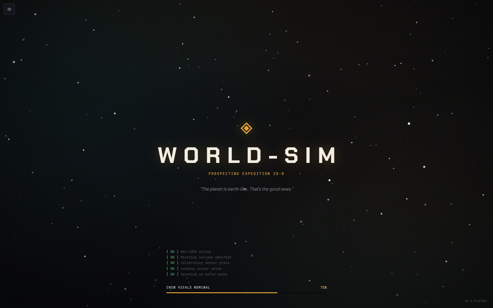
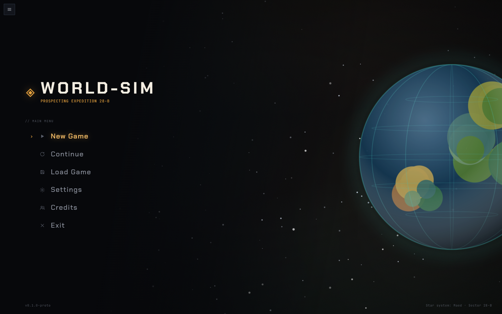
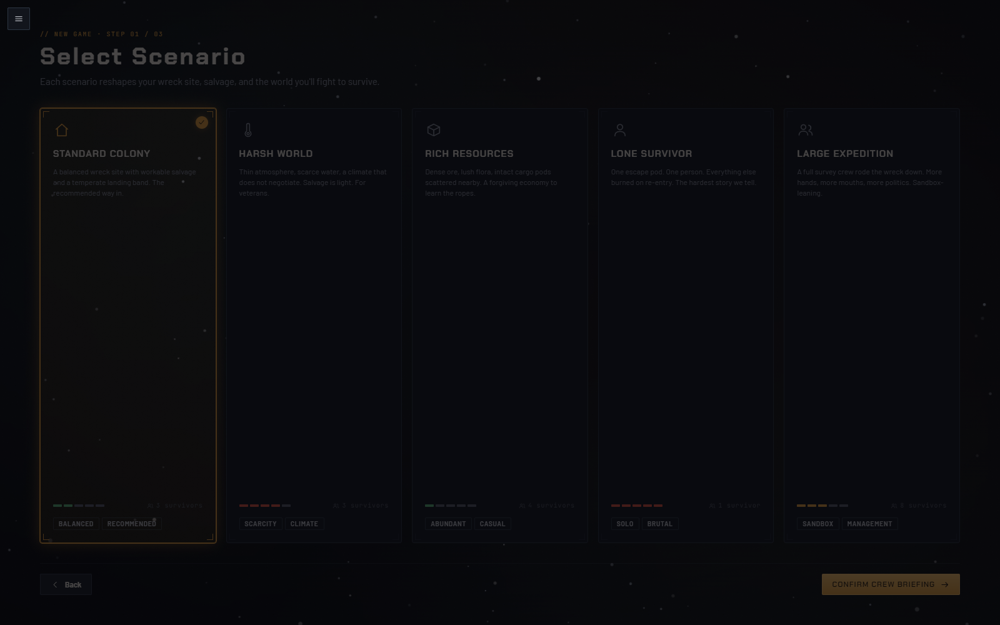
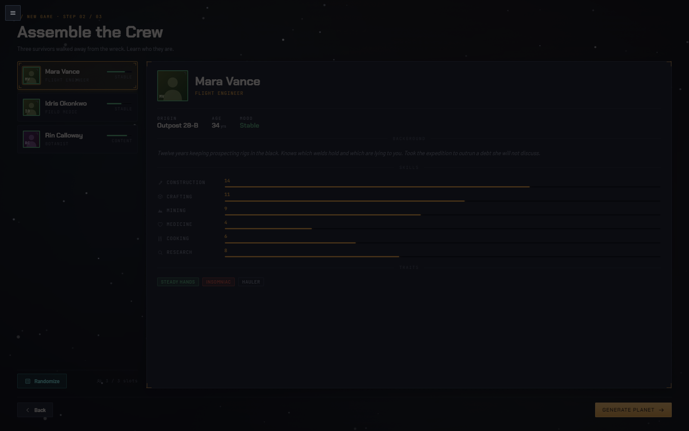
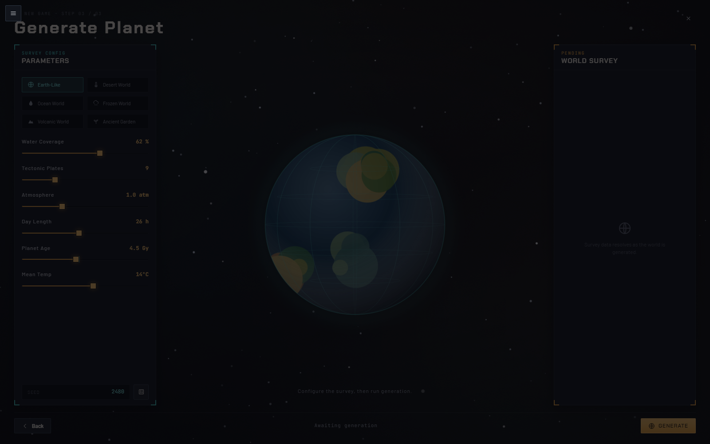
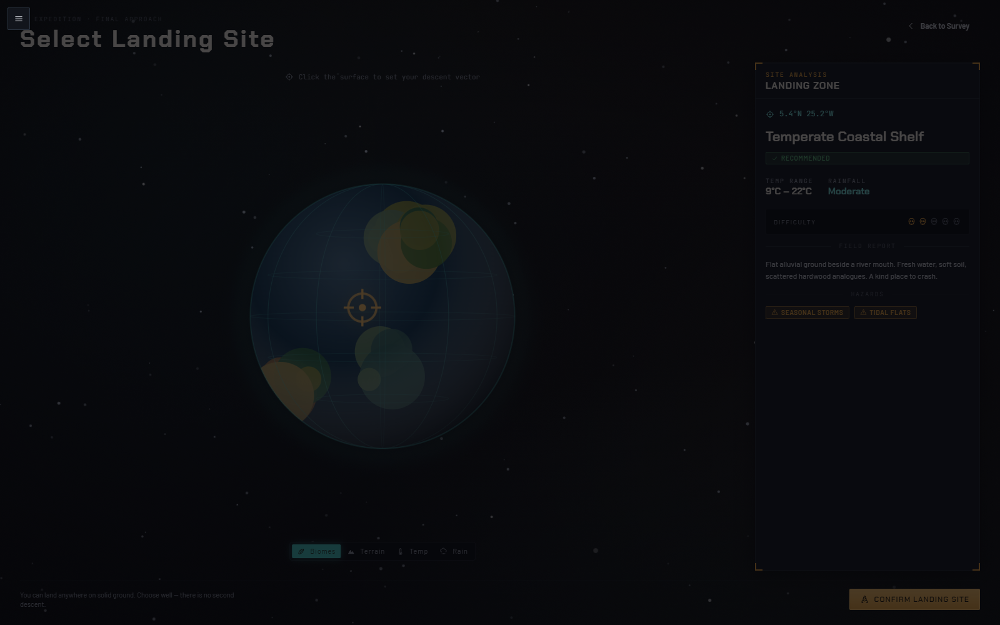

## In-game

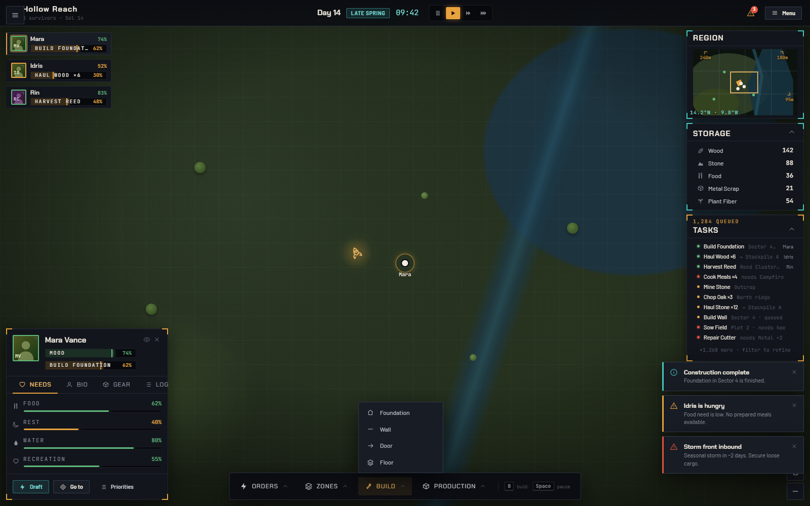
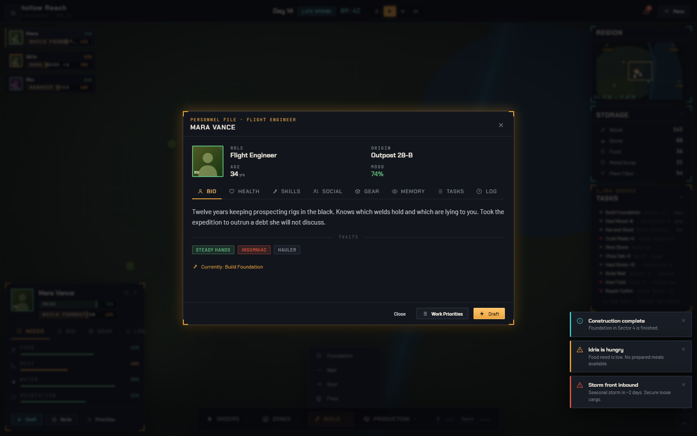
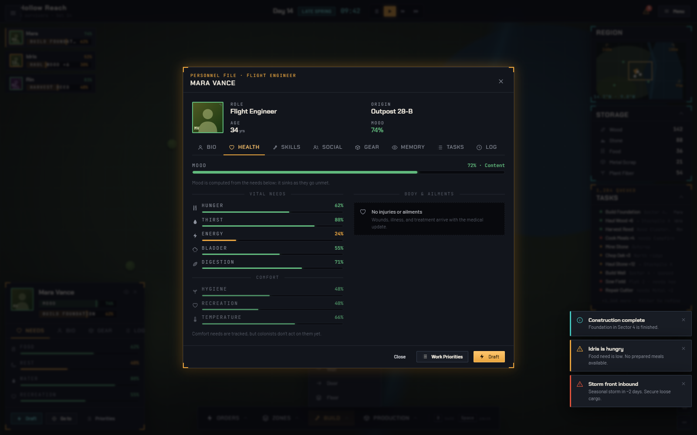
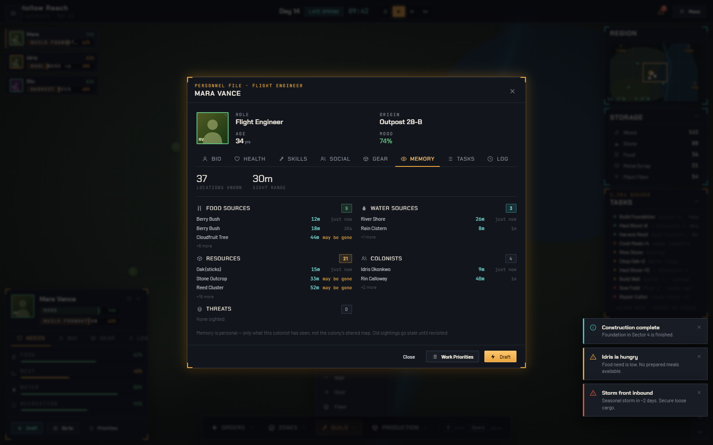
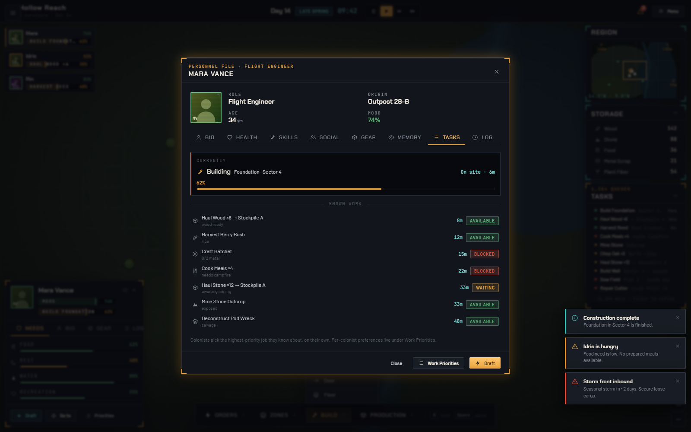
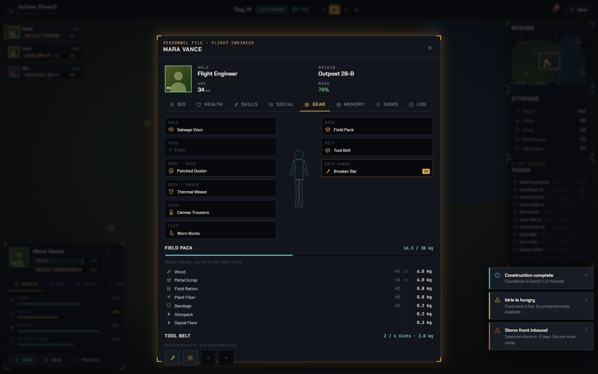

## Design-system gallery

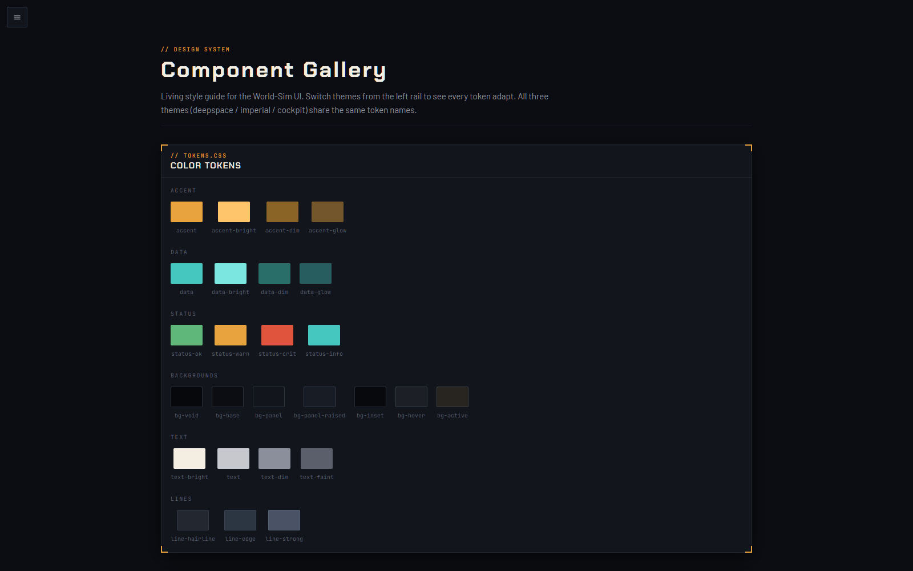

## Anatomy wireframes

Schematic region maps for the dense screens (vector, lightweight).

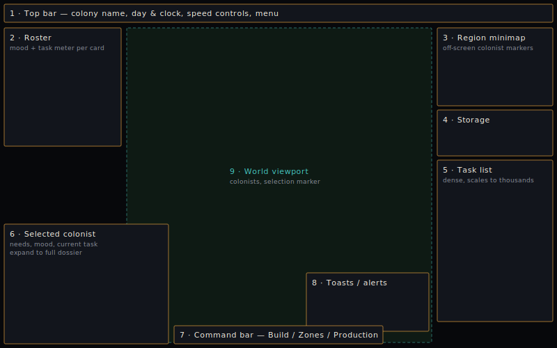
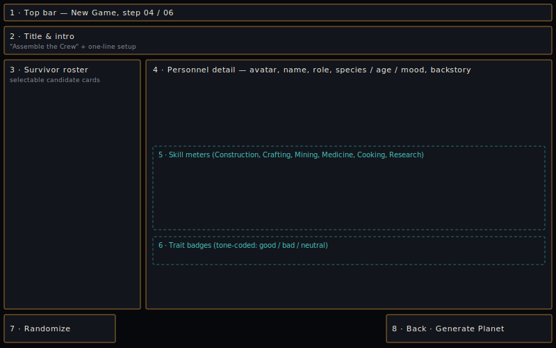
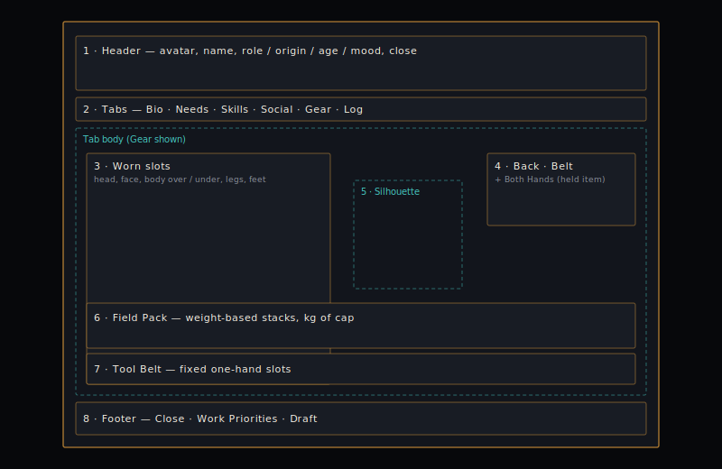
